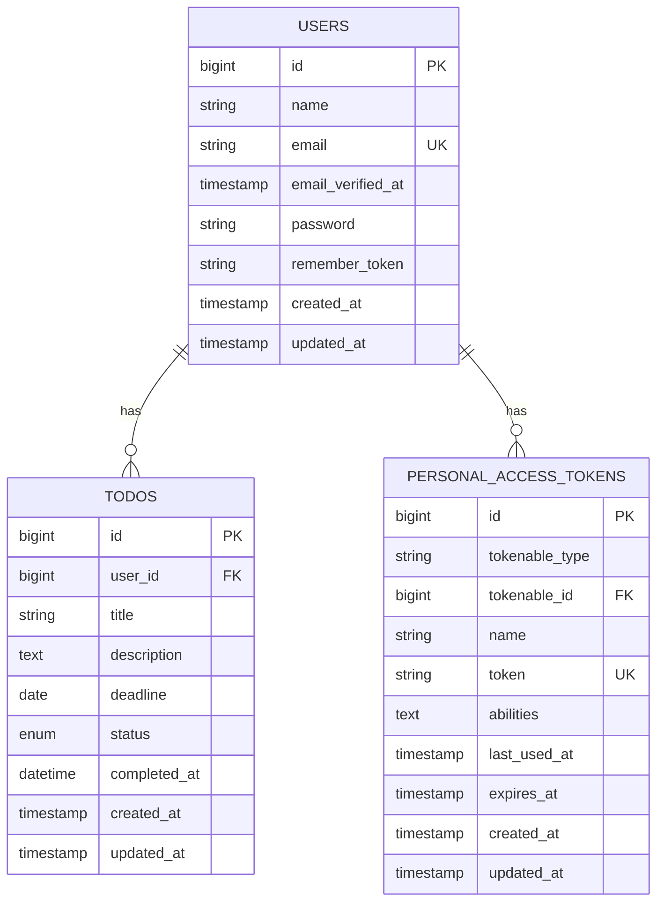
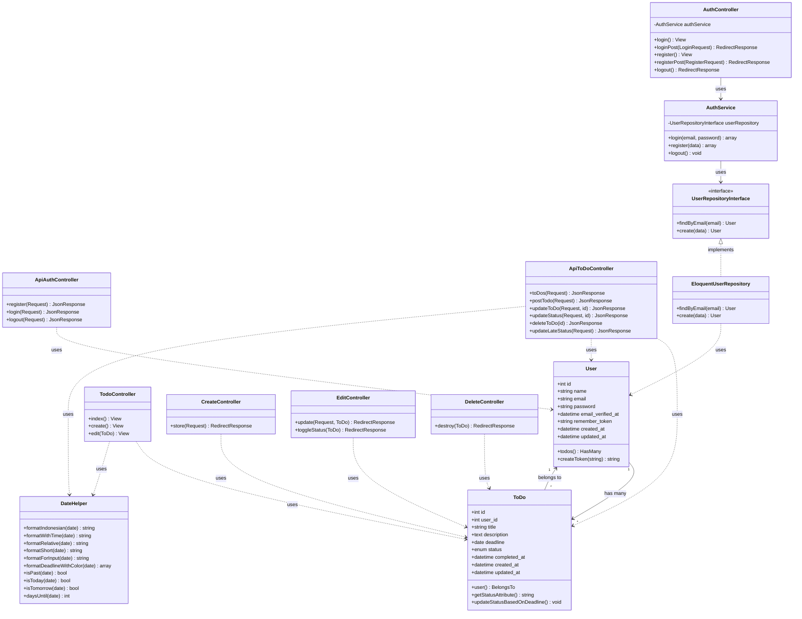

# 📋 ToDoList Sederhana

<p align="center">
  
</p>

<p align="center">
<a href="https://github.com/Renymh24/ToDoList_sedernaha"></a>
<a href="https://github.com/Renymh24/ToDoList_sedernaha"></a>
<a href="https://github.com/Renymh24/ToDoList_sedernaha"></a>
</p>

## 📑 Daftar Isi

- [Tentang Project](#-tentang-project)
- [Fitur Utama](#-fitur-utama)
- [Teknologi](#-teknologi)
- [Instalasi](#-instalasi)
- [Konfigurasi](#️-konfigurasi)
- [Struktur Database](#️-struktur-database)
- [API Documentation](#-api-documentation)
- [Web Routes](#-web-routes)
- [Helper Functions](#-helper-functions)
- [Arsitektur](#️-arsitektur)
- [Testing](#-testing)
- [Kontribusi](#-kontribusi)
- [Lisensi](#-lisensi)

---

## 🎯 Tentang Project

**ToDoList Sederhana** adalah aplikasi manajemen tugas (Task Management System) berbasis web yang dibangun menggunakan Laravel 12. Aplikasi ini menyediakan dua interface:

1. **Web Interface** - Interface berbasis Blade Template untuk penggunaan browser
2. **REST API** - API endpoint dengan Laravel Sanctum authentication untuk mobile/SPA

### 🌟 Keunggulan

- ✅ **Dual Interface** - Web dan API dalam satu aplikasi
- ✅ **Authentication System** - Register, Login, Logout dengan Sanctum
- ✅ **Smart Status Management** - Auto-update status berdasarkan deadline
- ✅ **Indonesian Localization** - Format tanggal dalam Bahasa Indonesia
- ✅ **Color-Coded Deadlines** - Visual feedback untuk urgency tugas
- ✅ **Clean Architecture** - Service Pattern & Repository Pattern
- ✅ **Timezone Support** - Asia/Jakarta timezone handling

---

## ✨ Fitur Utama

### 🔐 User Authentication
- Registrasi pengguna baru
- Login dengan email & password
- Logout & token revocation
- Email verification support
- Token-based API authentication (Sanctum)

### 📝 Todo Management
- **Create** - Tambah tugas baru dengan title, description, dan deadline
- **Read** - Lihat daftar semua tugas milik user
- **Update** - Edit informasi tugas
- **Delete** - Hapus tugas
- **Toggle Status** - Quick toggle untuk menandai selesai/belum

### 📊 Smart Features
- **Auto Status Update** - Status otomatis berubah menjadi "late" jika melewati deadline
- **Status Types**:
  - `pending` - Tugas baru belum dikerjakan
  - `in_progress` - Sedang dikerjakan
  - `late` - Melewati deadline
  - `completed` - Selesai dikerjakan
- **Deadline Tracking** - Countdown hari tersisa
- **Color Coding** - Merah (hari ini/lewat), Kuning (3 hari), Hijau (aman)

### 🌐 Date Helper
- Format tanggal Indonesia (15 Januari 2025)
- Format tanggal relatif ("3 hari lagi", "2 hari yang lalu")
- Format tanggal dengan waktu
- Validasi tanggal (isPast, isToday, isTomorrow)
- Deadline dengan color badge

---

## 🛠️ Teknologi

### Backend
- **Laravel 12.0** - PHP Framework
- **PHP 8.2+** - Programming Language
- **MySQL/MariaDB** - Relational Database
- **Laravel Sanctum 4.0** - API Authentication
- **Carbon** - Date/Time Manipulation

### Development Tools
- **Composer** - PHP Dependency Manager
- **Artisan** - Laravel CLI
- **Faker** - Test Data Generator
- **PHPUnit 11.5** - Testing Framework

### Libraries
```json
{
    "laravel/framework": "^12.0",
    "laravel/sanctum": "^4.0",
    "laravel/tinker": "^2.10.1"
}
```

---

## 💻 Instalasi

### Prerequisites
- PHP >= 8.2
- Composer
- MySQL/MariaDB
- Web Server (Apache/Nginx) atau Laravel Valet/Laragon

### Langkah-langkah Instalasi

1. **Clone Repository**
```bash
git clone https://github.com/Renymh24/ToDoList_sedernaha.git
cd ToDoList_sedernaha
```

2. **Install Dependencies**
```bash
composer install
```

3. **Copy Environment File**
```bash
# Windows
copy .env.example .env

# Linux/Mac
cp .env.example .env
```

4. **Generate Application Key**
```bash
php artisan key:generate
```

5. **Konfigurasi Database**

Edit file `.env`:
```env
DB_CONNECTION=mysql
DB_HOST=127.0.0.1
DB_PORT=3306
DB_DATABASE=todolist_db
DB_USERNAME=root
DB_PASSWORD=
```

6. **Buat Database**
```sql
CREATE DATABASE todolist_db;
```

7. **Run Migrations**
```bash
php artisan migrate
```

8. **Load Helper Functions**
```bash
composer dump-autoload
```

9. **Start Development Server**
```bash
php artisan serve
```

Aplikasi akan berjalan di `http://localhost:8000`

### Instalasi untuk Development dengan Laragon

Jika menggunakan Laragon:
1. Clone project ke folder `C:\laragon\www\ToDoList_sedernaha`
2. Buka Laragon Menu → Database → Create Database → Buat `todolist_db`
3. Akses melalui `http://todolist_sedernaha.test`

---

## ⚙️ Konfigurasi

### Laravel Sanctum

File [`config/sanctum.php`](config/sanctum.php):
```php
'stateful' => explode(',', env('SANCTUM_STATEFUL_DOMAINS', 
    'localhost,localhost:3000,127.0.0.1,127.0.0.1:8000,::1'
)),

'expiration' => null, // Token tidak expire
```

### Timezone Configuration

File [`config/app.php`](config/app.php):
```php
'timezone' => 'Asia/Jakarta',
'locale' => 'id',
```

### Autoload Helpers

File [`composer.json`](composer.json):
```json
"autoload": {
    "files": [
        "app/Helpers/DateHelper.php",
        "app/Helpers/helpers.php"
    ]
}
```

Setelah modifikasi, jalankan:
```bash
composer dump-autoload
```

---

## 🗄️ Struktur Database

### ERD (Entity Relationship Diagram)



### Tabel: users

| Column | Type | Attributes |
|--------|------|------------|
| id | BIGINT UNSIGNED | PRIMARY KEY, AUTO_INCREMENT |
| name | VARCHAR(255) | NOT NULL |
| email | VARCHAR(255) | UNIQUE, NOT NULL |
| email_verified_at | TIMESTAMP | NULLABLE |
| password | VARCHAR(255) | NOT NULL |
| remember_token | VARCHAR(100) | NULLABLE |
| created_at | TIMESTAMP | NULLABLE |
| updated_at | TIMESTAMP | NULLABLE |

### Tabel: to_dos

| Column | Type | Attributes |
|--------|------|------------|
| id | BIGINT UNSIGNED | PRIMARY KEY, AUTO_INCREMENT |
| user_id | BIGINT UNSIGNED | FOREIGN KEY → users(id), ON DELETE CASCADE |
| title | VARCHAR(255) | NOT NULL |
| description | TEXT | NOT NULL |
| deadline | DATE | NOT NULL |
| status | ENUM | VALUES: pending, late, completed, DEFAULT: pending |
| completed_at | DATETIME | NULLABLE |
| created_at | TIMESTAMP | NULLABLE |
| updated_at | TIMESTAMP | NULLABLE |

### Tabel: personal_access_tokens (Sanctum)

| Column | Type | Attributes |
|--------|------|------------|
| id | BIGINT UNSIGNED | PRIMARY KEY, AUTO_INCREMENT |
| tokenable_type | VARCHAR(255) | NOT NULL |
| tokenable_id | BIGINT UNSIGNED | NOT NULL |
| name | VARCHAR(255) | NOT NULL |
| token | VARCHAR(64) | UNIQUE, NOT NULL |
| abilities | TEXT | NULLABLE |
| last_used_at | TIMESTAMP | NULLABLE |
| expires_at | TIMESTAMP | NULLABLE |
| created_at | TIMESTAMP | NULLABLE |
| updated_at | TIMESTAMP | NULLABLE |

---

## 🔌 API Documentation

### Base URL
```
http://localhost:8000/api
```

### Authentication

Semua endpoint (kecuali register dan login) memerlukan Bearer Token:
```http
Authorization: Bearer {your-token-here}
```

### Endpoints

#### 1. 🔐 Authentication Endpoints

##### Register
```http
POST /api/register
Content-Type: application/json

{
    "name": "John Doe",
    "email": "john@example.com",
    "password": "password123"
}
```

**Response Success (200):**
```json
{
    "status": 200,
    "message": "Registration success and login success",
    "user": {
        "id": 1,
        "name": "John Doe",
        "email": "john@example.com",
        "email_verified_at": "2025-12-13T10:00:00.000000Z",
        "created_at": "2025-12-13T10:00:00.000000Z",
        "updated_at": "2025-12-13T10:00:00.000000Z"
    },
    "token": "1|xxxxxxxxxxxxxxxxxxx"
}
```

**Response Error - Email Already Exists (401):**
```json
{
    "status": 401,
    "message": "Email already registered"
}
```

##### Login
```http
POST /api/login
Content-Type: application/json

{
    "email": "john@example.com",
    "password": "password123"
}
```

**Response Success (200):**
```json
{
    "status": 200,
    "message": "Login success",
    "user": {
        "id": 1,
        "name": "John Doe",
        "email": "john@example.com"
    },
    "token": "2|xxxxxxxxxxxxxxxxxxx"
}
```

**Response Error - Invalid Email (401):**
```json
{
    "status": 401,
    "message": "Email not registered.",
    "user": "john@example.com"
}
```

**Response Error - Invalid Password (401):**
```json
{
    "status": 401,
    "message": "Invalid Password.",
    "user": "john@example.com"
}
```

##### Logout
```http
POST /api/logout
Authorization: Bearer {token}
```

**Response Success (200):**
```json
{
    "status": 200,
    "message": "Logout success"
}
```

##### Get Current User
```http
GET /api/user
Authorization: Bearer {token}
```

**Response Success (200):**
```json
{
    "id": 1,
    "name": "John Doe",
    "email": "john@example.com",
    "email_verified_at": "2025-12-13T10:00:00.000000Z",
    "created_at": "2025-12-13T10:00:00.000000Z",
    "updated_at": "2025-12-13T10:00:00.000000Z"
}
```

---

#### 2. 📝 Todo Endpoints

##### Get All Todos
```http
GET /api/todos
Authorization: Bearer {token}
```

**Response Success (200):**
```json
{
    "status": 200,
    "message": "Data retrieved successfully",
    "data": [
        {
            "id": 1,
            "user_id": 1,
            "title": "Belajar Laravel",
            "description": "Menyelesaikan tutorial Laravel Sanctum",
            "deadline": "2025-12-20",
            "status": "pending",
            "completed_at": null,
            "created_at": "2025-12-13T10:00:00.000000Z",
            "updated_at": "2025-12-13T10:00:00.000000Z"
        },
        {
            "id": 2,
            "user_id": 1,
            "title": "Meeting Client",
            "description": "Diskusi requirements project",
            "deadline": "2025-12-12",
            "status": "late",
            "completed_at": null,
            "created_at": "2025-12-10T10:00:00.000000Z",
            "updated_at": "2025-12-13T10:00:00.000000Z"
        }
    ]
}
```

**Catatan:** Status akan otomatis terupdate menjadi "late" jika deadline sudah terlewat.

##### Create Todo
```http
POST /api/todos
Authorization: Bearer {token}
Content-Type: application/json

{
    "title": "Belajar Laravel",
    "description": "Menyelesaikan tutorial Laravel Sanctum",
    "deadline": "2025-12-20"
}
```

**Validasi:**
- `title`: required, string, max 255 karakter
- `description`: nullable, string
- `deadline`: required, date, harus hari ini atau setelahnya

**Response Success (200):**
```json
{
    "status": 200,
    "message": "Todo added successfully",
    "data": {
        "user_id": 1,
        "title": "Belajar Laravel",
        "description": "Menyelesaikan tutorial Laravel Sanctum",
        "deadline": "2025-12-20",
        "status": "pending",
        "updated_at": "2025-12-13T10:00:00.000000Z",
        "created_at": "2025-12-13T10:00:00.000000Z",
        "id": 1
    }
}
```

**Response Error - Validation (400):**
```json
{
    "status": 400,
    "message": "Failed to add todo: The deadline field must be a date after or equal to today.",
    "data": null
}
```

##### Update Todo
```http
PUT /api/todos/{id}
Authorization: Bearer {token}
Content-Type: application/json

{
    "title": "Belajar Laravel - Updated",
    "description": "Menyelesaikan tutorial + praktek",
    "deadline": "2025-12-25",
    "status": "in_progress"
}
```

**Validasi:**
- `title`: required, string, max 255
- `description`: nullable, string
- `deadline`: required, date
- `status`: nullable, in: pending, in_progress, completed, late

**Response Success (200):**
```json
{
    "status": 200,
    "message": "Todo updated successfully",
    "data": {
        "id": 1,
        "user_id": 1,
        "title": "Belajar Laravel - Updated",
        "description": "Menyelesaikan tutorial + praktek",
        "deadline": "2025-12-25",
        "status": "in_progress",
        "completed_at": null,
        "created_at": "2025-12-13T10:00:00.000000Z",
        "updated_at": "2025-12-13T11:00:00.000000Z"
    }
}
```

**Response Error - Not Found (404):**
```json
{
    "status": 404,
    "message": "Todo not found",
    "data": null
}
```

**Response Error - Unauthorized (403):**
```json
{
    "status": 403,
    "message": "Unauthorized",
    "data": null
}
```

##### Update Status Only
```http
PATCH /api/todos/{id}/status
Authorization: Bearer {token}
Content-Type: application/json

{
    "status": "completed"
}
```

**Response Success (200):**
```json
{
    "status": 200,
    "message": "Status updated successfully",
    "data": {
        "id": 1,
        "user_id": 1,
        "title": "Belajar Laravel",
        "description": "Menyelesaikan tutorial",
        "deadline": "2025-12-20",
        "status": "completed",
        "completed_at": "2025-12-13T11:00:00.000000Z",
        "created_at": "2025-12-13T10:00:00.000000Z",
        "updated_at": "2025-12-13T11:00:00.000000Z"
    }
}
```

##### Delete Todo
```http
DELETE /api/todos/{id}
Authorization: Bearer {token}
```

**Response Success (200):**
```json
{
    "status": 200,
    "message": "Todo deleted successfully",
    "data": null
}
```

**Response Error - Not Found (404):**
```json
{
    "status": 404,
    "message": "Todo not found",
    "data": null
}
```

##### Update Late Status (Batch)
```http
POST /api/todos/update-late-status
Authorization: Bearer {token}
```

**Response Success (200):**
```json
{
    "status": 200,
    "message": "Successfully updated 3 todos to late status",
    "updated_count": 3
}
```

Endpoint ini mengupdate semua todo yang melewati deadline menjadi status "late".

---

## 🌐 Web Routes

### Public Routes

#### Login Page
```
GET /login
```
Menampilkan form login.

#### Register Page
```
GET /register
```
Menampilkan form registrasi.

#### Login POST
```
POST /login-post
```
Memproses login user.

#### Register POST
```
POST /register-post
```
Memproses registrasi user baru.

### Protected Routes (Require Authentication)

#### Home / Todo List
```
GET /
```
Menampilkan daftar semua todo milik user yang login.

#### Create Todo Page
```
GET /todos/create
```
Menampilkan form untuk membuat todo baru.

#### Store Todo
```
POST /todos
```
Menyimpan todo baru ke database.

#### Edit Todo Page
```
GET /todos/{todo}/edit
```
Menampilkan form edit untuk todo tertentu.

#### Update Todo
```
PUT /todos/{todo}
```
Mengupdate data todo.

#### Delete Todo
```
DELETE /todos/{todo}
```
Menghapus todo dari database.

#### Toggle Status
```
PATCH /todos/{todo}/toggle
```
Quick toggle untuk mengubah status completed/pending.

#### Logout
```
GET /logout
```
Logout user dan redirect ke halaman login.

---

## 🔧 Helper Functions

### DateHelper Class

Class [`DateHelper`](app/Helpers/DateHelper.php) menyediakan berbagai method untuk manipulasi dan format tanggal.

#### Method List

| Method | Parameter | Return | Deskripsi |
|--------|-----------|--------|-----------|
| `formatIndonesian()` | string\|null $date | string | Format: "15 Januari 2025" |
| `formatWithTime()` | string\|null $date | string | Format: "15 Januari 2025, 14:30" |
| `formatRelative()` | string\|null $date | string | Format: "3 hari lagi" / "2 hari yang lalu" |
| `formatShort()` | string\|null $date | string | Format: "15 Jan 2025" |
| `formatForInput()` | string\|null $date | string | Format: "2025-01-15" (untuk input HTML5) |
| `isPast()` | string\|null $date | bool | Cek apakah tanggal sudah lewat |
| `isToday()` | string\|null $date | bool | Cek apakah tanggal hari ini |
| `isTomorrow()` | string\|null $date | bool | Cek apakah tanggal besok |
| `daysUntil()` | string\|null $date | int | Hitung sisa hari (negatif jika lewat) |
| `formatDeadlineWithColor()` | string\|null $date | array | Format + color badge |

#### Contoh Penggunaan di PHP

```php
use App\Helpers\DateHelper;

// Format tanggal Indonesia
echo DateHelper::formatIndonesian('2025-12-13');
// Output: "13 Desember 2025"

// Format dengan waktu
echo DateHelper::formatWithTime('2025-12-13 14:30:00');
// Output: "13 Desember 2025, 14:30"

// Format relatif
echo DateHelper::formatRelative('2025-12-16');
// Output: "3 hari lagi"

echo DateHelper::formatRelative('2025-12-10');
// Output: "3 hari yang lalu"

// Cek apakah sudah lewat
if (DateHelper::isPast('2025-12-10')) {
    echo "Deadline sudah terlewat!";
}

// Cek hari ini
if (DateHelper::isToday('2025-12-13')) {
    echo "Deadline hari ini!";
}

// Hitung sisa hari
$days = DateHelper::daysUntil('2025-12-20');
echo "Sisa $days hari lagi";

// Format deadline dengan warna
$deadline = DateHelper::formatDeadlineWithColor('2025-12-13');
// Returns: ['text' => 'Hari ini', 'color' => 'danger', 'days' => 0]
```

#### Global Helper Functions

File [`helpers.php`](app/Helpers/helpers.php) menyediakan fungsi global untuk kemudahan akses:

```php
// Di Controller atau Blade
echo formatDate($todo->deadline);
echo formatDateTime($todo->created_at);
echo formatDateRelative($todo->deadline);
echo formatDateShort($todo->deadline);

$deadline = formatDeadline($todo->deadline);
$inputValue = formatDateInput($todo->deadline);

if (isPastDate($todo->deadline)) {
    // Handle overdue
}

if (isToday($todo->deadline)) {
    // Handle today's deadline
}

if (isTomorrow($todo->deadline)) {
    // Handle tomorrow's deadline
}
```

#### Penggunaan di Blade Template

```blade
{{-- Format tanggal --}}
<p>Deadline: {{ formatDate($todo->deadline) }}</p>
{{-- Output: Deadline: 20 Desember 2025 --}}

{{-- Format relatif --}}
<small class="text-muted">{{ formatDateRelative($todo->created_at) }}</small>
{{-- Output: 3 hari yang lalu --}}

{{-- Format deadline dengan badge warna --}}
@php
    $deadline = formatDeadline($todo->deadline);
@endphp
<span class="badge bg-{{ $deadline['color'] }}">
    {{ $deadline['text'] }}
</span>
{{-- Output: <span class="badge bg-danger">Hari ini</span> --}}

{{-- Input date field --}}
<input type="date" 
       name="deadline" 
       value="{{ formatDateInput($todo->deadline) }}"
       min="{{ formatDateInput(now()) }}">

{{-- Conditional styling --}}
@if(isPastDate($todo->deadline) && $todo->status !== 'completed')
    <div class="alert alert-danger">
        <i class="fas fa-exclamation-triangle"></i>
        Tugas ini sudah melewati deadline!
    </div>
@elseif(isToday($todo->deadline))
    <div class="alert alert-warning">
        <i class="fas fa-clock"></i>
        Deadline hari ini!
    </div>
@endif

{{-- Countdown display --}}
@if(!isPastDate($todo->deadline))
    <div class="badge badge-info">
        <i class="far fa-calendar"></i>
        {{ formatDateRelative($todo->deadline) }}
    </div>
@endif
```

#### Deadline Color Coding Logic

```php
public static function formatDeadlineWithColor($date)
{
    if (!$date) {
        return [
            'text' => 'Tidak ada deadline',
            'color' => 'secondary',
            'days' => null
        ];
    }

    $deadline = Carbon::parse($date);
    $now = Carbon::now();
    $daysUntil = $now->diffInDays($deadline, false);

    // Sudah lewat
    if ($daysUntil < 0) {
        return [
            'text' => abs($daysUntil) . ' hari yang lalu',
            'color' => 'danger',
            'days' => $daysUntil
        ];
    }

    // Hari ini
    if ($daysUntil == 0) {
        return [
            'text' => 'Hari ini',
            'color' => 'danger',
            'days' => 0
        ];
    }

    // Besok
    if ($daysUntil == 1) {
        return [
            'text' => 'Besok',
            'color' => 'warning',
            'days' => 1
        ];
    }

    // 2-3 hari lagi
    if ($daysUntil <= 3) {
        return [
            'text' => $daysUntil . ' hari lagi',
            'color' => 'warning',
            'days' => $daysUntil
        ];
    }

    // Lebih dari 3 hari
    return [
        'text' => $daysUntil . ' hari lagi',
        'color' => 'success',
        'days' => $daysUntil
    ];
}
```

---

## 🏗️ Arsitektur

### Class Diagram



### Folder Structure

```
ToDoList_sedernaha/
├── app/
│   ├── Helpers/
│   │   ├── DateHelper.php          # Date manipulation helper
│   │   └── helpers.php              # Global helper functions
│   ├── Http/
│   │   ├── Controllers/
│   │   │   ├── Api/
│   │   │   │   ├── AuthController.php   # API Authentication
│   │   │   │   └── ToDoController.php   # API Todo CRUD
│   │   │   ├── AuthController.php       # Web Authentication
│   │   │   ├── TodoController.php       # Web Todo Display
│   │   │   ├── CreateController.php     # Web Todo Create
│   │   │   ├── EditController.php       # Web Todo Update
│   │   │   └── DeleteController.php     # Web Todo Delete
│   │   ├── Middleware/
│   │   └── Requests/
│   │       ├── LoginRequest.php
│   │       └── RegisterRequest.php
│   ├── Models/
│   │   ├── User.php                 # User Model
│   │   └── ToDo.php                 # Todo Model
│   ├── Repositories/
│   │   ├── UserRepositoryInterface.php
│   │   └── EloquentUserRepository.php
│   └── Services/
│       └── AuthService.php          # Authentication Business Logic
├── bootstrap/
│   ├── app.php
│   └── providers.php
├── config/
│   ├── app.php
│   ├── auth.php
│   ├── database.php
│   └── sanctum.php
├── database/
│   ├── factories/
│   │   └── UserFactory.php
│   ├── migrations/
│   │   ├── 0001_01_01_000000_create_users_table.php
│   │   ├── 2025_05_30_072355_create_to_dos_table.php
│   │   └── 2025_05_30_072501_create_personal_access_tokens_table.php
│   └── seeders/
│       └── DatabaseSeeder.php
├── public/
│   └── index.php
├── resources/
│   ├── css/
│   │   └── app.css
│   ├── js/
│   │   └── app.js
│   └── views/
│       ├── auth/
│       │   ├── login.blade.php
│       │   └── register.blade.php
│       ├── todos/
│       │   ├── index.blade.php       # Todo List
│       │   ├── create.blade.php      # Create Form
│       │   └── edit.blade.php        # Edit Form
│       └── index.blade.php
├── routes/
│   ├── api.php                      # API Routes
│   ├── web.php                      # Web Routes
│   └── console.php
├── storage/
│   ├── app/
│   ├── framework/
│   └── logs/
├── tests/
│   ├── Feature/
│   └── Unit/
├── .env                             # Environment Configuration
├── .env.example
├── artisan                          # Laravel CLI
├── composer.json                    # PHP Dependencies
└── README.md                        # This file
```

### Design Patterns Used

#### 1. **Repository Pattern**
```php
// Interface
interface UserRepositoryInterface {
    public function findByEmail(string $email);
    public function create(array $data);
}

// Implementation
class EloquentUserRepository implements UserRepositoryInterface {
    public function findByEmail(string $email) {
        return User::where('email', $email)->first();
    }
}
```

#### 2. **Service Pattern**
```php
class AuthService {
    private UserRepositoryInterface $userRepository;
    
    public function login($email, $password) {
        $user = $this->userRepository->findByEmail($email);
        // Business logic here
    }
}
```

#### 3. **MVC Pattern**
- **Model**: User, ToDo
- **View**: Blade Templates
- **Controller**: Memisahkan API dan Web Controllers

#### 4. **Dependency Injection**
```php
public function __construct(AuthService $authService)
{
    $this->authService = $authService;
}
```

---

## 🧪 Testing

### Running Tests

```bash
# Run all tests
php artisan test

# Run specific test file
php artisan test tests/Feature/TodoTest.php

# Run with coverage
php artisan test --coverage
```

### Example Unit Test

Create file `tests/Unit/DateHelperTest.php`:

```php
<?php

namespace Tests\Unit;

use Tests\TestCase;
use App\Helpers\DateHelper;
use Carbon\Carbon;

class DateHelperTest extends TestCase
{
    public function test_format_indonesian()
    {
        Carbon::setTestNow('2025-12-13');
        
        $date = '2025-12-13';
        $result = DateHelper::formatIndonesian($date);
        
        $this->assertEquals('13 Desember 2025', $result);
    }

    public function test_is_past()
    {
        Carbon::setTestNow('2025-12-13');
        
        $pastDate = '2025-12-10';
        $this->assertTrue(DateHelper::isPast($pastDate));
        
        $futureDate = '2025-12-20';
        $this->assertFalse(DateHelper::isPast($futureDate));
    }

    public function test_is_today()
    {
        Carbon::setTestNow('2025-12-13');
        
        $this->assertTrue(DateHelper::isToday('2025-12-13'));
        $this->assertFalse(DateHelper::isToday('2025-12-14'));
    }

    public function test_days_until()
    {
        Carbon::setTestNow('2025-12-13');
        
        $futureDate = '2025-12-18';
        $this->assertEquals(5, DateHelper::daysUntil($futureDate));
        
        $pastDate = '2025-12-10';
        $this->assertEquals(-3, DateHelper::daysUntil($pastDate));
    }

    public function test_format_deadline_with_color()
    {
        Carbon::setTestNow('2025-12-13');
        
        // Today - should be danger
        $result = DateHelper::formatDeadlineWithColor('2025-12-13');
        $this->assertEquals('danger', $result['color']);
        $this->assertEquals('Hari ini', $result['text']);
        
        // Tomorrow - should be warning
        $result = DateHelper::formatDeadlineWithColor('2025-12-14');
        $this->assertEquals('warning', $result['color']);
        
        // More than 3 days - should be success
        $result = DateHelper::formatDeadlineWithColor('2025-12-20');
        $this->assertEquals('success', $result['color']);
        
        // Past - should be danger
        $result = DateHelper::formatDeadlineWithColor('2025-12-10');
        $this->assertEquals('danger', $result['color']);
    }
}
```

### Example Feature Test

Create file `tests/Feature/Api/TodoApiTest.php`:

```php
<?php

namespace Tests\Feature\Api;

use Tests\TestCase;
use App\Models\User;
use App\Models\ToDo;
use Illuminate\Foundation\Testing\RefreshDatabase;
use Laravel\Sanctum\Sanctum;

class TodoApiTest extends TestCase
{
    use RefreshDatabase;

    public function test_user_can_register()
    {
        $response = $this->postJson('/api/register', [
            'name' => 'Test User',
            'email' => 'test@example.com',
            'password' => 'password123'
        ]);

        $response->assertStatus(200)
            ->assertJsonStructure([
                'status',
                'message',
                'user' => ['id', 'name', 'email'],
                'token'
            ]);

        $this->assertDatabaseHas('users', [
            'email' => 'test@example.com'
        ]);
    }

    public function test_user_can_login()
    {
        $user = User::factory()->create([
            'email' => 'test@example.com',
            'password' => bcrypt('password123')
        ]);

        $response = $this->postJson('/api/login', [
            'email' => 'test@example.com',
            'password' => 'password123'
        ]);

        $response->assertStatus(200)
            ->assertJsonStructure(['status', 'message', 'user', 'token']);
    }

    public function test_user_can_create_todo()
    {
        $user = User::factory()->create();
        Sanctum::actingAs($user);

        $response = $this->postJson('/api/todos', [
            'title' => 'Test Todo',
            'description' => 'Test Description',
            'deadline' => '2025-12-20'
        ]);

        $response->assertStatus(200)
            ->assertJson([
                'status' => 200,
                'message' => 'Todo added successfully'
            ]);

        $this->assertDatabaseHas('to_dos', [
            'title' => 'Test Todo',
            'user_id' => $user->id
        ]);
    }

    public function test_user_can_only_see_own_todos()
    {
        $user1 = User::factory()->create();
        $user2 = User::factory()->create();

        ToDo::factory()->create(['user_id' => $user1->id]);
        ToDo::factory()->create(['user_id' => $user2->id]);

        Sanctum::actingAs($user1);

        $response = $this->getJson('/api/todos');

        $response->assertStatus(200);
        $this->assertCount(1, $response->json('data'));
    }

    public function test_user_cannot_update_others_todo()
    {
        $user1 = User::factory()->create();
        $user2 = User::factory()->create();

        $todo = ToDo::factory()->create(['user_id' => $user2->id]);

        Sanctum::actingAs($user1);

        $response = $this->putJson("/api/todos/{$todo->id}", [
            'title' => 'Updated Title',
            'description' => 'Updated Description',
            'deadline' => '2025-12-20'
        ]);

        $response->assertStatus(403)
            ->assertJson(['message' => 'Unauthorized']);
    }

    public function test_todo_status_auto_updates_to_late()
    {
        $user = User::factory()->create();
        Sanctum::actingAs($user);

        // Create todo with past deadline
        $todo = ToDo::create([
            'user_id' => $user->id,
            'title' => 'Old Todo',
            'description' => 'Old Description',
            'deadline' => '2025-12-10',
            'status' => 'pending'
        ]);

        $response = $this->getJson('/api/todos');

        $response->assertStatus(200);
        
        $todos = $response->json('data');
        $this->assertEquals('late', $todos[0]['status']);
    }

    public function test_cannot_create_todo_with_past_deadline()
    {
        $user = User::factory()->create();
        Sanctum::actingAs($user);

        $response = $this->postJson('/api/todos', [
            'title' => 'Test Todo',
            'description' => 'Test Description',
            'deadline' => '2025-12-10'
        ]);

        $response->assertStatus(400);
    }
}
```

### Running Specific Tests

```bash
# Run only unit tests
php artisan test --testsuite=Unit

# Run only feature tests
php artisan test --testsuite=Feature

# Run with verbose output
php artisan test --verbose

# Run specific test method
php artisan test --filter test_user_can_create_todo
```

---

## 📚 Best Practices

### 1. **Security**
- ✅ Password di-hash menggunakan `bcrypt`
- ✅ Validasi input pada setiap endpoint
- ✅ CSRF protection pada web routes
- ✅ Authorization check (user hanya bisa akses todo sendiri)
- ✅ SQL Injection prevention dengan Eloquent
- ✅ XSS prevention dengan Blade escaping

### 2. **Code Quality**
- ✅ Follow PSR-12 coding standards
- ✅ Type hinting pada method parameters
- ✅ PHPDoc comments untuk dokumentasi
- ✅ Separation of Concerns (Controller, Service, Repository)
- ✅ DRY (Don't Repeat Yourself) dengan Helper functions

### 3. **Database**
- ✅ Migrations untuk version control database
- ✅ Foreign key constraints
- ✅ Soft deletes untuk data penting (optional)
- ✅ Index pada foreign keys
- ✅ Timestamps untuk audit trail

### 4. **Performance**
- ✅ Eager loading untuk relasi (mencegah N+1 query)
- ✅ Database indexing
- ✅ Query optimization
- ✅ Caching untuk data yang sering diakses (optional)

### 5. **API Design**
- ✅ RESTful naming conventions
- ✅ Consistent response format
- ✅ Proper HTTP status codes
- ✅ Token-based authentication
- ✅ API versioning (optional for future)

---

## 🐛 Troubleshooting

### Issue: Token not working

**Problem:** API return 401 Unauthorized setelah login.

**Solution:**
```bash
# Clear config cache
php artisan config:clear
php artisan cache:clear

# Make sure Sanctum is properly configured
php artisan config:cache
```

### Issue: DateHelper class not found

**Problem:** Error "Class 'App\Helpers\DateHelper' not found"

**Solution:**
```bash
# Reload composer autoload
composer dump-autoload

# Make sure helpers are registered in composer.json
# Check autoload.files section
```

### Issue: Migration error

**Problem:** Error saat running migration.

**Solution:**
```bash
# Reset database
php artisan migrate:fresh

# If still error, check database connection in .env
# Make sure database exists
```

### Issue: Timezone mismatch

**Problem:** Tanggal/waktu tidak sesuai timezone Indonesia.

**Solution:**

Edit [`config/app.php`](config/app.php):
```php
'timezone' => 'Asia/Jakarta',
```

Then clear config:
```bash
php artisan config:clear
```

### Issue: CORS Error (API)

**Problem:** Frontend tidak bisa akses API karena CORS.

**Solution:**

Install Laravel CORS:
```bash
composer require fruitcake/laravel-cors
```

Update [`config/cors.php`](config/cors.php):
```php
'paths' => ['api/*'],
'allowed_origins' => ['*'],
```

---

## 🤝 Kontribusi

Kontribusi sangat diterima! Jika Anda ingin berkontribusi:

1. Fork repository ini
2. Create feature branch (`git checkout -b feature/AmazingFeature`)
3. Commit changes (`git commit -m 'Add some AmazingFeature'`)
4. Push to branch (`git push origin feature/AmazingFeature`)
5. Open Pull Request

### Coding Standards

- Follow PSR-12 coding style
- Write PHPDoc comments
- Add unit/feature tests for new features
- Update documentation jika diperlukan

---

## 📄 Lisensi

Project ini dilisensikan di bawah [MIT License](https://opensource.org/licenses/MIT).

```
MIT License

Copyright (c) 2025 Renymh24

Permission is hereby granted, free of charge, to any person obtaining a copy
of this software and associated documentation files (the "Software"), to deal
in the Software without restriction, including without limitation the rights
to use, copy, modify, merge, publish, distribute, sublicense, and/or sell
copies of the Software, and to permit persons to whom the Software is
furnished to do so, subject to the following conditions:

The above copyright notice and this permission notice shall be included in all
copies or substantial portions of the Software.

THE SOFTWARE IS PROVIDED "AS IS", WITHOUT WARRANTY OF ANY KIND, EXPRESS OR
IMPLIED, INCLUDING BUT NOT LIMITED TO THE WARRANTIES OF MERCHANTABILITY,
FITNESS FOR A PARTICULAR PURPOSE AND NONINFRINGEMENT. IN NO EVENT SHALL THE
AUTHORS OR COPYRIGHT HOLDERS BE LIABLE FOR ANY CLAIM, DAMAGES OR OTHER
LIABILITY, WHETHER IN AN ACTION OF CONTRACT, TORT OR OTHERWISE, ARISING FROM,
OUT OF OR IN CONNECTION WITH THE SOFTWARE OR THE USE OR OTHER DEALINGS IN THE
SOFTWARE.
```

---

## 📞 Support & Contact

- **Developer:** Renymh24
- **Repository:** [github.com/Renymh24/ToDoList_sedernaha](https://github.com/Renymh24/ToDoList_sedernaha)
- **Issues:** [GitHub Issues](https://github.com/Renymh24/ToDoList_sedernaha/issues)
- **Email:** -

---

## 🎉 Changelog

### Version 1.0.0 (December 2025)
- ✅ Initial release
- ✅ User authentication (Web & API)
- ✅ Todo CRUD operations
- ✅ Laravel Sanctum integration
- ✅ DateHelper implementation
- ✅ Indonesian localization
- ✅ Auto status update based on deadline
- ✅ Service & Repository pattern
- ✅ Comprehensive documentation

---

## 🙏 Acknowledgments

- Laravel Framework Team
- Carbon Library Maintainers
- Laravel Sanctum Team
- Open Source Community

---

**Dibuat dengan ❤️ menggunakan Laravel 12**

## Code of Conduct

In order to ensure that the Laravel community is welcoming to all, please review and abide by the [Code of Conduct](https://laravel.com/docs/contributions#code-of-conduct).

## Security Vulnerabilities

If you discover a security vulnerability within Laravel, please send an e-mail to Taylor Otwell via [taylor@laravel.com](mailto:taylor@laravel.com). All security vulnerabilities will be promptly addressed.

## License

The Laravel framework is open-sourced software licensed under the [MIT license](https://opensource.org/licenses/MIT).
